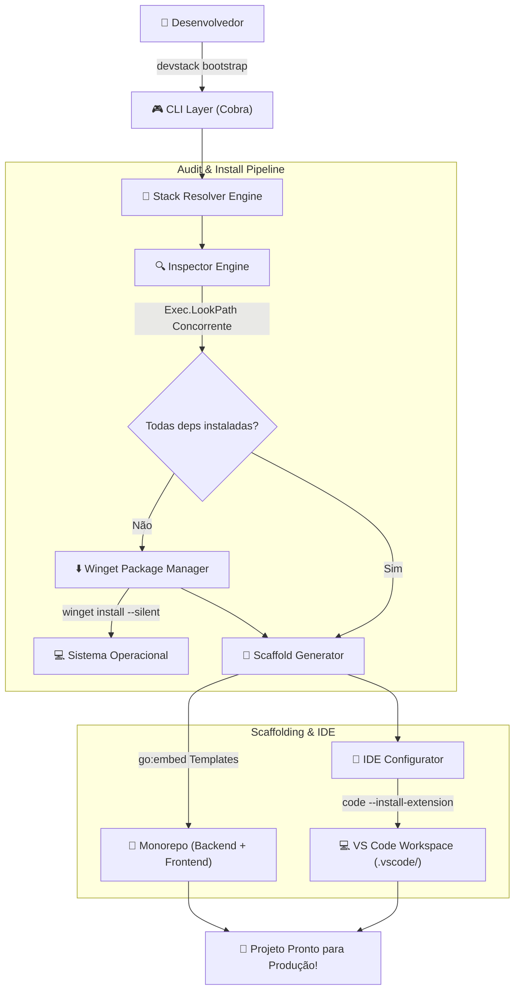

<div align="center">

<a href="https://github.com/HeloisaPeGarcia/DevStack-CLI">
  
</a>

### *The AI-Powered Dev-Environment & Winget Automation Engine*

[](https://go.dev)
[](https://microsoft.com/winget)
[](LICENSE)
[](https://github.com/HeloisaPeGarcia/DevStack-CLI/actions)
[](SECURITY.md)

---

**DevStack** transforma a configuração de um ambiente de desenvolvimento de **2 horas de instalações manuais** em **1 comando automatizado de 30 segundos**.

[Recursos](#-recursos) • [Demonstração](#-demonstração-terminal) • [Instalação](#-instalação-rápida) • [Arquitetura](#-arquitetura-do-sistema) • [Wiki](#-documentação-e-wiki) • [Segurança](#-segurança)

</div>

---

## 📺 Demonstração (Terminal Output)

```text
┌────────────────────────────────────────────────────────────────────────────┐
│ 🚀 DevStack CLI v1.0.0 — Bootstrapping: Go Backend + React Frontend       │
└────────────────────────────────────────────────────────────────────────────┘

 [1/4] 🔍 Auditando Ferramentas no Sistema...
  ✔ Go SDK                  [INSTALADO] (go version go1.22.5 windows/amd64)
  ✔ Node.js LTS             [INSTALADO] (v20.17.0)
  ⚠ PNPM Package Manager    [FALTANDO]  (Executável 'pnpm' não encontrado)
  ✔ Docker Desktop          [INSTALADO] (Docker version 25.0.3)
  ✔ VS Code                 [INSTALADO] (1.89.0)
  ✔ Git                     [INSTALADO] (git version 2.45.0)
  ⚠ PostgreSQL 16           [FALTANDO]  (Executável 'psql' não encontrado)

 [2/4] ⬇️ Instalação Silenciosa via Winget...
  ✔ PNPM.PNPM               [BAIXANDO & INSTALANDO] ───► 100% [Concluído]
  ✔ PostgreSQL.PostgreSQL.16 [BAIXANDO & INSTALANDO] ───► 100% [Concluído]

 [3/4] 📁 Scaffolding de Monorepo em 'C:\Projects\my-app'...
  ✔ backend/cmd/api/main.go (API HTTP em Go com HealthCheck & CORS)
  ✔ frontend/src/App.tsx     (React 18 + Vite + TypeScript)
  ✔ docker-compose.yml       (PostgreSQL 16 + API Go)
  ✔ Makefile                 (dev-backend, dev-frontend, docker-up)

 [4/4] 🎨 Configuração Automática de IDE (VS Code)...
  ✔ Extensões: golang.go, esbenp.prettier-vscode, dbaeumer.vscode-eslint
  ✔ .vscode/settings.json, launch.json, extensions.json criados!

 🎉 BOOTSTRAP CONCLUÍDO COM SUCESSO EM 28.4s!
```

---

## ✨ Recursos

- ⚡ **Zero-Dependencies & Ultra-Fast:** Compilado em binário nativo Go (`.exe`), executa em milissegundos sem precisar de Node ou Python no sistema.
- 🔍 **Auditoria Concorrente de Sistema:** Verifica ferramentas no `%PATH%` usando goroutines em paralelo.
- ⬇️ **Winget Automation:** Instalação silenciosa de pacotes homologados com checagem automática de privilégios (UAC).
- 📦 **Monorepo Boilerplate Generator:** Scaffolding de estruturas prontas para produção com Go, React, Docker Compose e Makefiles.
- 🎨 **IDE Orchestration:** Auto-instalação de extensões do VS Code e geração de `.vscode/settings.json` e `launch.json`.
- 🤖 **Resolução Inteligente:** Resolve stacks por IDs, aliases (`fullstack-go`, `fastapi`, `mevn`) ou linguagem natural.

---

## 🏗️ Arquitetura do Sistema

### Fluxo de Execução do Pipeline



---

## 📊 Matriz de Stacks Suportadas

| Stack ID | Nome da Pilha | Tecnologias Incluídas | Extensões VS Code |
| :--- | :--- | :--- | :--- |
| `go-react` | **Go + React Monorepo** | Go 1.22+, Node.js 20, PNPM, Docker, PostgreSQL 16, Git | `golang.go`, `prettier`, `eslint`, `docker` |
| `python-fastapi` | **Python FastAPI + Streamlit** | Python 3.12, FastAPI, Streamlit, Git, VS Code | `ms-python.python`, `pylance`, `autopep8` |
| `node-vue` | **Node.js Express + Vue 3** | Node.js LTS, Express, Vue 3, Vite, TypeScript | `Vue.volar`, `prettier`, `eslint` |

---

## ⚡ Instalação Rápida

> [!TIP]
> O DevStack é distribuído como um binário único e autônomo sem dependências externas.

### Opção 1: Via PowerShell (Instalação em 1 Clique para Windows)

Abra o PowerShell e execute:

```powershell
iwr -useb https://raw.githubusercontent.com/HeloisaPeGarcia/DevStack-CLI/main/run_devstack.ps1 | iex
```

### Opção 2: Via `go install` (Desenvolvedores Go)

```bash
go install github.com/HeloisaPeGarcia/DevStack-CLI/cmd/devstack@latest
```

### Opção 3: Compilação Local com Makefile

```bash
git clone https://github.com/HeloisaPeGarcia/DevStack-CLI.git
cd DevStack-CLI
make install
```

---

## 💻 Guia de Uso do CLI

### 1. Listar Pilhas Disponíveis
```bash
devstack list-stacks
```

### 2. Auditar o Ambiente Atual
```bash
devstack audit --stack go-react
```

### 3. Modo Simulação (Dry-Run)
```bash
devstack bootstrap --stack "go-react" --project-name meu-app --dry-run
```

### 4. Executar Bootstrap Completo
```bash
devstack bootstrap --stack "Go Backend + React Frontend" --project-name meu-app-prod
```

> [!NOTE]
> Se o projeto exigir pacotes que necessitam de elevação UAC (ex: Docker Desktop), execute o terminal como Administrador.

---

## 📖 Documentação & Wiki

Para uma explicação detalhada das decisões arquiteturais, internals e guia avançado:

- 📚 **[Wiki Técnica Completa](docs/WIKI.md)**
  - Decisão de Design: Go vs Rust/Python
  - Motor de Auditoria e Concorrência
  - Integração com a API do Winget e Windows UAC
  - Guia de Criação de Receitas Customizadas

---

## 🛡️ Segurança & Compliance

Segurança é prioridade no DevStack. Todas as instalações executadas pelo Winget passam por verificação estrita:

- **Assinatura de Código:** Validação de certificados digitais do fabricante antes da execução.
- **Hashes SHA-256:** Verificação de integridade dos binários baixados.
- **Sanitização de Argumentos:** Proteção contra injeção de comandos em subprocessos.

Veja nossa **[Política de Segurança (SECURITY.md)](SECURITY.md)** para mais detalhes ou para relatar vulnerabilidades.

---

## 🤝 Contribuindo

Contribuições são super bem-vindas! Veja o guia abaixo para começar:

1. Faça o Fork do projeto
2. Crie sua Feature Branch (`git checkout -b feature/nova-stack`)
3. Faça o Commit das alterações (`git commit -m 'feat: adiciona stack Elixir'`)
4. Roda os testes: `make test`
5. Abra um Pull Request

---

<div align="center">

Desenvolvido com ❤️ e Go • [Licença MIT](LICENSE)

</div>
