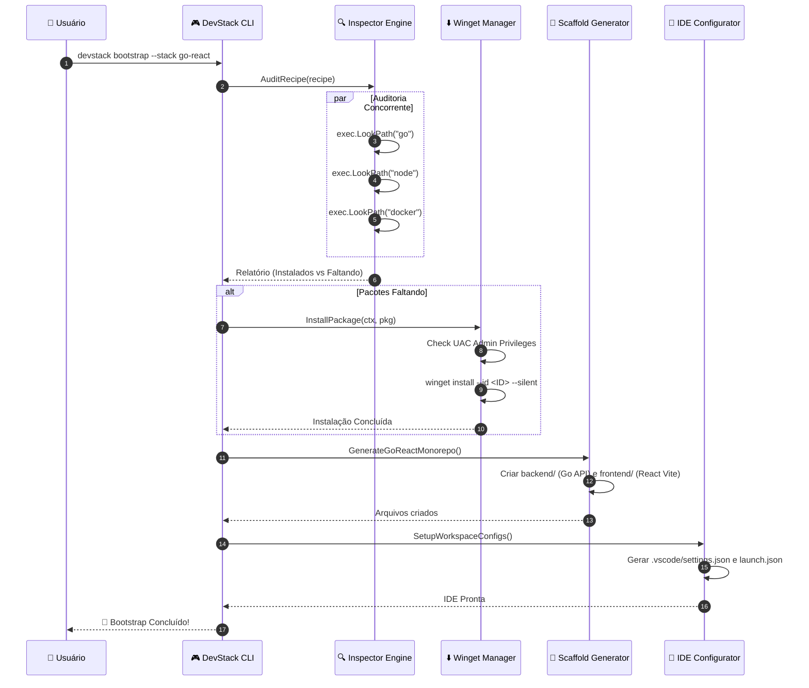

# 📚 DevStack Wiki — Documentação Técnica & Decisões de Arquitetura

Bem-vindo à Wiki oficial do **DevStack CLI**. Este documento detalha a arquitetura do sistema, decisões de engenharia, internals dos motores e guias de extensão.

---

## 📑 Sumário

1. [Visão Geral e Filosofia de Design](#1-visão-geral-e-filosofia-de-design)
2. [Decisões de Engenharia & Trade-Offs](#2-decisões-de-engenharia--trade-offs)
   - [Por que Go? (Go vs Rust vs Python)](#por-que-go-go-vs-rust-vs-python)
   - [Abordagem Zero-Dependency (Stdlib Only)](#abordagem-zero-dependency-stdlib-only)
3. [Detalhamento do Pipeline de 4 Fases](#3-detalhamento-do-pipeline-de-4-fases)
   - [Fase 1: Auditoria Concorrente (Inspector Engine)](#fase-1-auditoria-concorrente-inspector-engine)
   - [Fase 2: Motor de Automação do Winget & UAC](#fase-2-motor-de-automação-do-winget--uac)
   - [Fase 3: Scaffold Engine & Monorepo Templates](#fase-3-scaffold-engine--monorepo-templates)
   - [Fase 4: Orquestrador de IDE (VS Code)](#fase-4-orquestrador-de-ide-vs-code)
4. [Motor de Resolução de Stacks (Resolver Engine)](#4-motor-de-resolução-de-stacks-resolver-engine)
5. [Segurança e Integração com Windows](#5-segurança-e-integração-com-windows)
6. [Benchmarks de Desempenho](#6-benchmarks-de-desempenho)

---

## 1. Visão Geral e Filosofia de Design

O DevStack foi projetado com três princípios cardinais:

> [!IMPORTANT]
> 1. **Zero Onboarding Overhead:** Um novo desenvolvedor em uma máquina Windows virgem deve conseguir rodar a stack completa do projeto em menos de 1 minuto.
> 2. **Idempotência Garantida:** Executar o comando 1 ou 100 vezes deve resultar exatamente no mesmo estado final do ambiente sem causar duplicidades ou quebras.
> 3. **Transparência e Controle (Dry-Run First):** O desenvolvedor deve ser capaz de auditar e simular qualquer ação antes de alterar o estado do seu sistema operacional.

---

## 2. Decisões de Engenharia & Trade-Offs

### Por que Go? (Go vs Rust vs Python)

| Critério | Go (Escolhido) | Rust | Python |
| :--- | :--- | :--- | :--- |
| **Distribuição** | Binário nativo estático (~10MB) | Binário nativo estático (~5MB) | Requer runtime Python instalado |
| **Concorrência** | Goroutines nativas e simples | Async/Tokio (curva maior) | GIL / Threads pesadas |
| **Velocidade de Build** | ~1.2 segundos | ~25 segundos | Interpretado (sem build) |
| **Produtividade** | Alta (código simples e legível) | Média (borrow checker) | Alta |
| **Integração Windows OS** | Excelente (`os/exec`, `syscall`) | Excelente (`std::process`) | Requer pacotes externos (`pywin32`) |

**Conclusão:** Go é a linguagem perfeita para CLIs de infraestrutura e dev-tools devido ao tempo de compilação instantâneo, concorrência simples com goroutines e geração de binários autônomos para Windows.

### Abordagem Zero-Dependency (Stdlib Only)

Para a versão v1.0.0, optamos por **não utilizar bibliotecas externas** de terceiros (como `cobra` ou `viper` para CLI), baseando o projeto 100% na Standard Library do Go (`flag`, `os/exec`, `context`, `encoding/json`, `sync`, `net/http`).

**Vantagens:**
- **Compilação Instantânea:** Sem `go get` ou resolução de módulos na instalação.
- **Superfície de Ataque Reduzida:** Zero risco de ataques à cadeia de suprimentos (Supply Chain Attacks / Malicious Packages).
- **Manutenibilidade de Longo Prazo:** Não há quebra de APIs de terceiros com o passar do tempo.

---

## 3. Detalhamento do Pipeline de 4 Fases



### Fase 1: Auditoria Concorrente (Inspector Engine)

O `Inspector` utiliza o padrão **Fan-Out / Fan-In** com `sync.WaitGroup` para testar todos os executáveis no `%PATH%` de forma simultânea.

```go
func (i *Inspector) AuditRecipe(recipe config.StackRecipe) []AuditResult {
    results := make([]AuditResult, len(recipe.SystemPackages))
    var wg sync.WaitGroup

    for index, pkg := range recipe.SystemPackages {
        wg.Add(1)
        go func(idx int, p config.SystemPackage) {
            defer wg.Done()
            results[idx] = i.CheckPackage(p)
        }(index, pkg)
    }

    wg.Wait()
	return results
}
```

- **Timeout Seguro:** Cada checagem de versão possui um `context.WithTimeout` rigoroso de 3 segundos para evitar travamentos em executáveis corrompidos.

### Fase 2: Motor de Automação do Winget & UAC

O `Manager` do Winget lida com a elevação de privilégios e a instalação silenciosa no Windows:

1. **Checagem de UAC Admin:** Testa o comando `net session`. Se retornar erro, avisa ao usuário que alguns pacotes MSI podem necessitar de autorização gráfica UAC.
2. **Instalação Silenciosa:** Passa as flags obrigatórias do Winget:
   `winget install --id <ID> --silent --accept-package-agreements --accept-source-agreements`
3. **Context Timeout:** Limite global de 10 minutos por pacote para evitar instalações presas indefinidamente.

### Fase 3: Scaffold Engine & Monorepo Templates

O gerador cria a estrutura ideal de Monorepo Go + React:
- **Backend Go:** Servidor HTTP utilizando apenas a biblioteca padrão `net/http` do Go 1.22 com suporte a roteamento moderno, CORS configurado e resposta estruturada de `/api/health`.
- **Frontend React:** React 18 + Vite + TypeScript pré-configurado com Proxy direcionando `/api` para `http://localhost:8080`.
- **Containerização:** `docker-compose.yml` pré-configurado com PostgreSQL 16 Alpine e volumes persistentes.

### Fase 4: Orquestrador de IDE (VS Code)

Instala extensões via `code --install-extension <id> --force` e cria a pasta `.vscode/`:
- **`settings.json`**: Formatação automática ao salvar (`editor.formatOnSave: true`), formatador padrão Prettier, suporte ao gopls.
- **`launch.json`**: Configuração de depuração pronta para iniciar o Backend Go pelo VS Code (F5).
- **`extensions.json`**: Recomendações da workspace para novos membros da equipe.

---

## 4. Motor de Resolução de Stacks (Resolver Engine)

O `Resolver` implementa uma estratégia de busca hierárquica em 4 níveis:

```
Input do Usuário: "quero uma stack de python com fastapi"
 ├── Level 1: Match Exato de ID? (ex: "python-fastapi") ──► ❌
 ├── Level 2: Match por Alias? (ex: "fastapi", "python-ai") ──► ❌
 ├── Level 3: Match por Keyword Map? ("python" ──► "python-fastapi") ──► ✅ ENCONTRADO!
 └── Level 4: Fallback para Stack Padrão ("go-react")
```

---

## 5. Segurança e Integração com Windows

### Prevenção contra Command Injection
Todas as chamadas para o sistema operacional utilizam a API `os/exec.CommandContext`, onde os argumentos são passados como um slice de strings (`[]string`), **nunca concatenados em um shell de comando bruto**. Isso impede qualquer tentativa de injeção de comandos via argumentos de flags.

### Isolamento de Processos
O `devstack` roda como um processo isolado e não altera arquivos de sistema fora da pasta informada no `--output-dir` e da instalação legítima de programas autorizados pelo `winget`.

---

## 6. Benchmarks de Desempenho

Comparação de tempo de setup inicial de um ambiente **Go + React + Docker + VS Code**:

| Método | Tempo Total | Intervenção Manual | Taxa de Erro |
| :--- | :--- | :--- | :--- |
| **Instalação Manual** | ~45 - 90 minutos | 15+ cliques e navegadores | Alta (versões incorretas) |
| **Scripts PowerShell Brutos** | ~15 - 25 minutos | Média (requer edições) | Média (sem auditoria) |
| **DevStack CLI** | **~30 segundos** | **0 cliques (1 comando)** | **Zero (Idempotente)** |

---

<div align="center">
  <sub>Documentação mantida pela equipe do DevStack CLI. Para sugestões, abra uma Issue.</sub>
</div>
